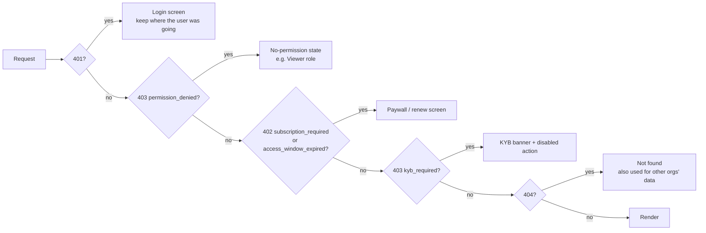
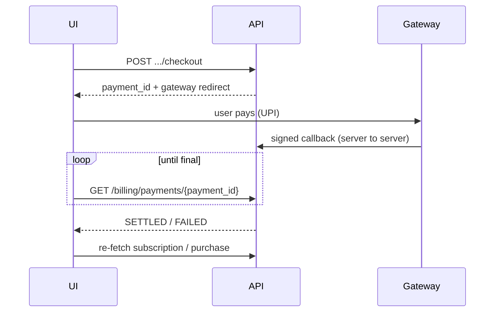
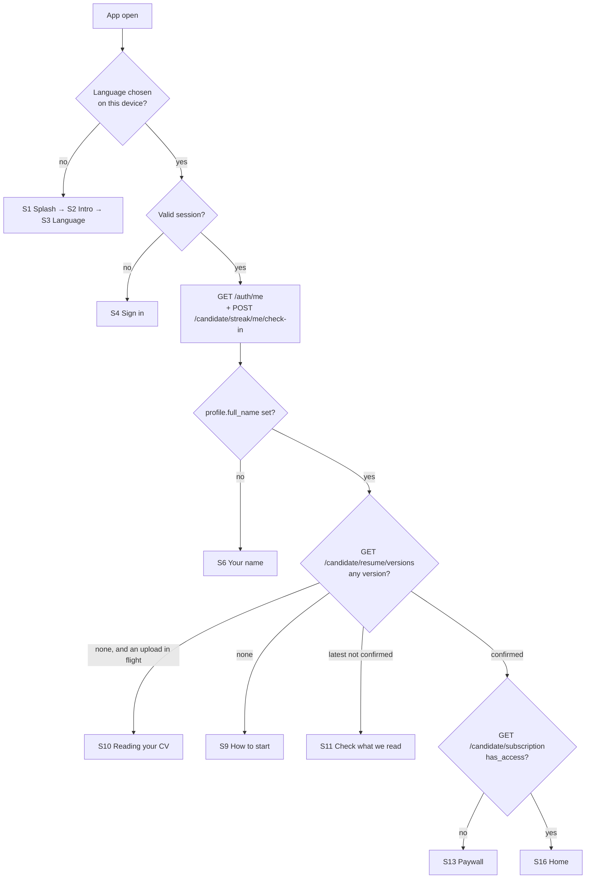
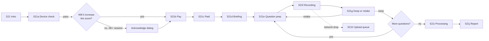
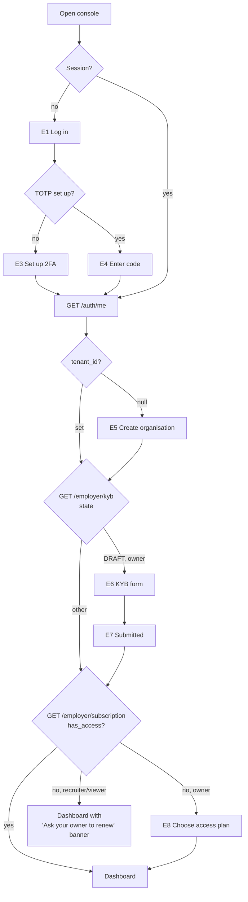
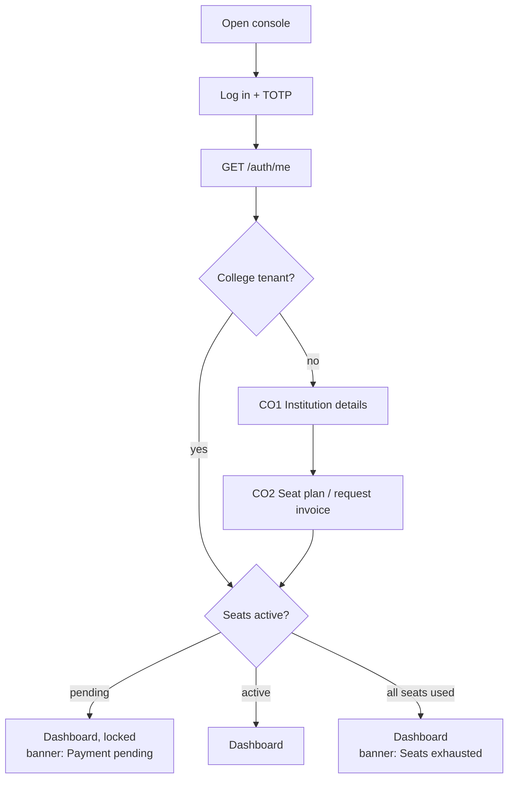
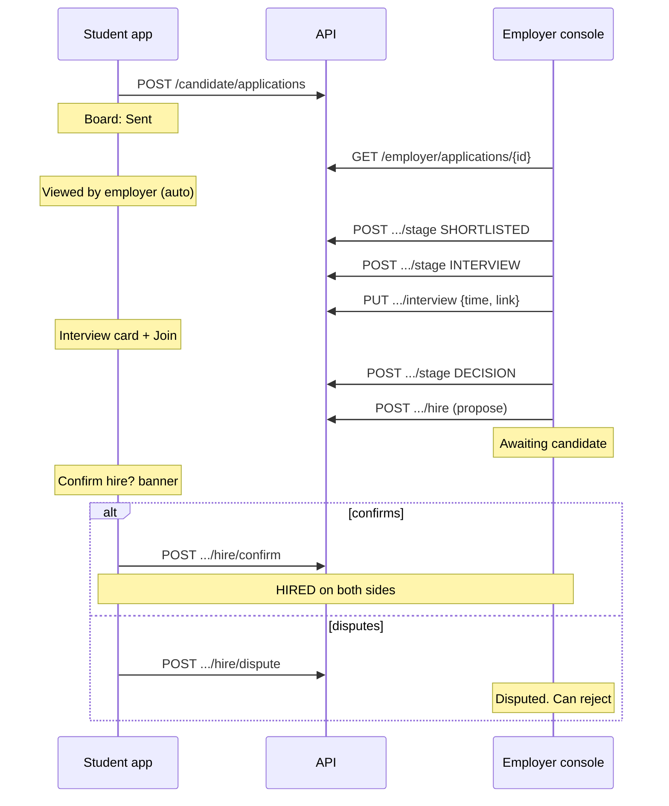
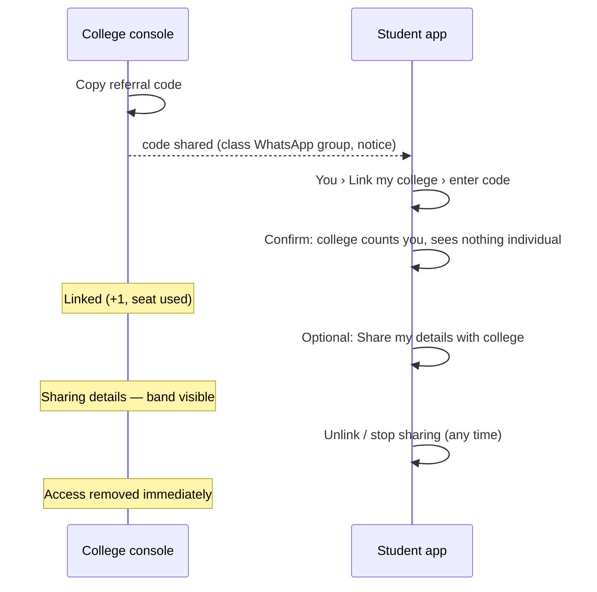

# Screen flows — Student app, Employer console, College console

**For:** the frontend teams building the candidate Android app and the employer
and college web consoles.

**What this is:** every screen, the order people reach them in, what decides
which screen they land on, and every state a screen has to draw. Each screen
lists the API calls behind it.

**Read it next to the HTML mockups:**

| Surface | Mockup file | What it contains |
|---|---|---|
| Student app | `BharatPath R_26Aug2026.dc (1).html` | 42 phone screens, with a numbered index on the left |
| Employer console | `BharatPath Employer Portal (standalone).html` | Sign-up, KYB and the full console. **DEMO STATE** in the header switches between KYB and credit states |
| College console | `BharatPath College Portal (standalone).html` | Sign-up, seat payment and the full console. **DEMO STATE** switches between payment states |
| Admin console | `BharatPath Admin Portal (standalone).html` | Not covered here |

> ### ⚠️ Where the mockups and the product differ, the product wins
>
> The mockups were drawn before several client decisions. The student mockup is
> dated 26 August. The largest changes since then:
>
> - **Nothing is free.** Every audience pays before using the product (R13).
> - **Nobody can use the app without an account**, not even to upload a CV (R3).
> - **The score is never explained**: no breakdown, no suggestions, no "X points short" (R11).
> - **The scale is 700–990**, not 680–999 (R2, R10).
> - **Employers do not unlock candidates, and there are no credits.** An employer pays for a
>   period and can open any profile. Every open is logged (R14).
> - **The mock interview is audio only.** It has no camera and no lighting check.
>
> Each section below has a **"Differs from mockup"** table. Build what the
> table says, not what the mockup shows. Where the table says *open*, the
> client has not decided yet. Build the default it names and keep it easy to
> change.

---

## Contents

1. [Shared rules for all surfaces](#1-shared-rules-for-all-surfaces)
2. [Student app](#2-student-app)
3. [Employer console](#3-employer-console)
4. [College console](#4-college-console)
5. [Flows that cross surfaces](#5-flows-that-cross-surfaces)
6. [Reference: states, bands, error codes](#6-reference)
7. [What is not built yet](#7-what-is-not-built-yet)

---

## 1. Shared rules for all surfaces

### 1.1 Who logs in where

| Surface | Sign-in | Account pool |
|---|---|---|
| Student app | Phone + 6-digit OTP (primary), or email. Google is planned but not configured yet | Candidate pool |
| Employer console | Email + password + authenticator-app code (TOTP), **mandatory** | Business pool |
| College console | Email + password + TOTP, mandatory | Business pool |

- Cognito issues the token, and the API has no login endpoint. After sign-in,
  call **`GET /api/v1/auth/me`**. It returns `{user_id, role, pool, tenant_id}`,
  and **that response is the source of truth for role and organisation**, not
  the token claims. A removed team member loses access within about 60 seconds.
- A token from the wrong pool is rejected (`pool_role_mismatch`). A candidate
  cannot sign in to the employer console.
- Local development: `POST /api/v1/auth/dev/token` issues a real token without
  Cognito, but only when the backend runs with `AUTH_ALLOW_LOCAL_TOKENS=true`.

### 1.2 The gate order: check each response and route on it

Every paid screen can refuse for one of these reasons. The API checks them in
this order, so handle them in this order:

- **A 404 can also mean "belongs to someone else".** Never show "you don't have
  access to this", because that confirms the item exists.
- **402 is not an error screen.** It sends the user to the paywall with their
  context kept, so they return to the same place after paying.

### 1.3 Error format

Errors come back as `application/problem+json` with a stable **`code`** and
`params`. **The API never sends display text.** Every surface maps `code` to
copy in its own locale files. §6.3 lists the codes each screen must handle.

### 1.4 Payments: the one flow every surface shares

The client never grants anything. Only the gateway's server-to-server callback
does.

Every checkout needs these screens:

| State | What to show |
|---|---|
| **Processing** | "Waiting for your bank to confirm." Poll the payment. Never show success from the gateway's client-side return alone |
| **Pending too long** (~2 min) | "Still waiting. You have not been charged twice." Offer Refresh and a support link |
| **Failed** | "Payment failed. Nothing was charged and nothing is used up." Offer Try again |
| **Success** | Only after the payment is settled **and** the re-fetched subscription or purchase shows access |

Local and staging: `POST /billing/dev/payments/{id}/simulate` with
`{outcome: "SUCCESS" | "FAILED"}` runs the real callback path. In a running API
today, a real callback is stored but not settled until the task worker lands
(blocker E15). **Use the simulate route while building.**

### 1.5 Design rules that are requirements

- **The score is never drawn as a gauge, dial or speedometer, and never on a
  red-to-green scale.** It looks like a credit bureau score, which is a legal
  risk. Use a horizontal marker on a neutral track, a single-hue bar, or just
  the number. The student mockup's circular arc and the college mockup's
  `ph-gauge` icon both need replacing.
- **Never use the words** "credit score", "creditworthiness", "CIBIL", "loan"
  or "underwriting" in UI copy. CI fails the build on them. The employer
  mockup's "credits" goes away anyway (§3).
- **No age, date of birth, gender, religion, caste, marital status or photo
  fields** anywhere.
- Body text is 16px on mobile, nothing is below 13px, and touch targets are
  at least 48×48dp. Every state needs an icon or word as well as a colour.
  Details are in `docs/design-system.md` and `docs/design-tokens.json`.
- **Every screen needs these states:** loading (a skeleton), slow (after ~3s),
  empty (say what to do next), error (what happened and what to try),
  offline, and partially complete (for uploads).
- **Eight locales:** en, hi, mr, bn, te, ta, gu, kn. All copy comes from locale
  files. Use Noto Sans for each script.

---

## 2. Student app

Android, phone-first, low-end devices, slow networks.

### 2.1 Differs from mockup

| Mockup shows | Build instead | Why |
|---|---|---|
| "Try it — no account": intro → language → CV → score, **then** sign-up | **Sign up first.** Language → phone OTP → name → CV. Nothing before the account | R3: no anonymous flow |
| Score before paying; Home says "Mock interview ₹299" as the only price | **Paywall after the CV is confirmed.** Score, jobs, questionnaire and interview all need an active subscription | R13 pay-first. Upload and confirm stay open to non-payers so the hook is "your score is ready" (E17) |
| Score "OUT OF 999", starts at 680 | **700–990.** 700 is the lowest possible score | R2, R10 |
| Bands "Emerging / Building", "Band 1 of 4", "28 to next band" | Bands **ENTRY 700–769 · DEVELOPING 770–819 · SOLID 820–864 · STRONG 865–990**, from the API's `band`. **No "points to next band"** | That distance is an explanation (R11) |
| Screens 11–13: breakdown, "Every point explained", suggestions, "+26 fix applied" | **Remove all three.** The score screen shows the number, the band and the date. Nothing else | R11: never explained |
| "Recalculated instantly" | Changing the CV creates a **new version → review → confirm → PENDING → new score**. It is asynchronous | Confirm gate |
| Circular gauge on the score screen | Number plus a horizontal position marker | §1.5 |
| Jobs: "Needs 680", "Their bar 680", "14 short", "Nine more unlock at 734", "Tell me when I reach 720" | Only **Eligible** or **Not eligible**. **Never show a job's threshold number or the gap** | R11. The API does not send the threshold |
| Blocked job: "One fix closes the gap → Work on my score" | Generic message: "Your score does not meet this employer's requirement." Optional links to the add-ons, with no promise about this job | R11 |
| Questionnaire "FREE", 24 Likert questions, "Employers see only a badge" | **12 questions** of mixed types (single, multi, number, yes/no, text), **behind the subscription, no badge**. It still never changes the score | Built bank; blocker E21 |
| Mock interview "Resume score: Not affected" | **A completed session adds +20** to the score, up to +60 across three sessions. From the fourth session on, say clearly *before payment* that it will not increase the score | R1, R10 |
| Interview "Audio or video", camera and lighting checks | **Audio only.** Checks: microphone, audio output, network, storage, quiet room | Decided |
| "One retake per question" | A retake is allowed **only before the answer is submitted**. Once `/complete` is called, the answer is final | A stored answer never changes |
| "Your session waits 30 days", "deleted after 90 days", "report under 10 min" | Don't promise durations. The session stays open until finished. **Audio retention is undecided** (E22) and evaluation is stubbed | Open items |
| Privacy "Who has seen me · unlocked your contact" | No unlocks exist. Employers can open any profile with an active subscription. **"Who viewed me" has no API yet** | R14 |
| "Let employers find me" toggle | **Not built.** Leave it out | — |
| Application detail: "Reschedule" | Not built. The candidate can **Withdraw**, and at a proposed hire, **Confirm hire** or **Dispute**. Both are missing from the mockup and must be added | Pipeline API |
| Filters: distance in km; Full-time/Part-time/Internship | API filters: `q`, `location`, `work_mode` (ONSITE/HYBRID/REMOTE), `skill`, `min_salary_minor`, `eligible_only` | Job board API |
| No course, no streak, no name capture, no college code | **Add:** name at sign-up, course, daily streak, college referral code | Client decisions after 26 Aug |
| Upload "PDF · DOCX" | Correct. **Legacy `.doc` is refused** (`resume_legacy_doc_unsupported`) | Round 10 |

### 2.2 Navigation

Bottom bar, four tabs, as in the mockup: **Home · Jobs · Board · You**.

Reached from those tabs: Score, Questionnaire, Mock interview, Course, Streak,
Notifications (bell on Home), Settings, and Privacy (both under You).

### 2.3 The app-open router

On every cold start and every return to the foreground, run these checks **in
order** and send the user to the first screen that matches. If the app was
opened from a deep link or notification, go there once the user passes the
router.

Notes:

- **The streak check-in runs on every foreground**, including before paying.
  It is idempotent per IST day, and a check-in without a subscription is fine.
- "Upload in flight" means a `resume_file_id` is saved locally and its status
  poll has not reached `terminal: true`.
- **A lapsed subscriber keeps everything and loses access.** Send them to the
  paywall in renew mode, but let them reach **Board** (their applications)
  and **You**. `GET /candidate/applications` is deliberately not paywalled.

### 2.4 First-run and sign-up

#### S1 · Splash — mockup 01
Logo animation. Hold it only until the router has decided, up to about 1.5s,
not the mockup's 3.9s. The user can tap to skip.

#### S2 · Intro — mockup 02
- Headline and one sentence about the score.
- **"Get started"** → S3. **"I already have an account"** → S4 (the language
  still defaults to the device language).
- Change the mockup's "Get started free" copy. Nothing is free.

#### S3 · Language — mockup 03
- English, हिंदी, मराठी, plus "5 more" (bn, te, ta, gu, kn).
- Tapping a language saves it on the device and then → S4. Send it to the
  profile once the account exists.
- The mockup's "STEP 1 OF 3" counter can stay, but restart the count at S4.

#### S4 · Sign in / create account — mockup 14 (restyled: no score on it)
- Phone field with a fixed **+91** prefix and numeric keypad; **"Send code"**.
- "or" → **"Use email instead"**. Keep **"Continue with Google"** hidden until
  Google is configured on the candidate pool.
- Sign-up and sign-in are **the same screen**. The OTP flow finds or creates
  the account.

| State | UI |
|---|---|
| Invalid number | Inline field error. Send stays disabled until 10 digits |
| Sending | Button spinner; block a double tap |
| Rate limited (`retry_after_seconds`) | "Try again in 0:45" countdown on the button |
| Offline | Inline banner; keep the typed number |

API: `POST /auth/otp/start {phone}` → 202 `{retry_after_seconds}`. **The
response is the same whether or not the number already has an account.** Never
show "welcome back" or "new user" based on it. Then the Cognito custom-auth
challenge.

#### S5 · Enter the code — mockup 15
- Six boxes that auto-advance, with SMS autofill (Android SMS Retriever).
- "Sent to +91 98765 43242 · **Change**" → S4.
- **"Resend in 0:24"**; the timer comes from `retry_after_seconds`.
- Keep "Call me instead" hidden. No voice OTP is configured.

| State | UI |
|---|---|
| Wrong code | Shake, clear the boxes, "That code is not right" |
| Expired code | "This code has expired. Send a new one" |
| Too many attempts | Lock with a countdown |
| Success | Continue to the router (§2.3) |

#### S6 · Your name — not in mockup (new)
- One field, **"Your full name"**, with the helper text "Employers see this only
  when they open your profile."
- Continue → `PUT /candidate/profile/name {full_name}` → S7.
- This is never guessed from the CV. The API refuses the field if it looks
  like contact data.

#### S7 · Notifications permission — mockup 17
- Keep the mockup's list of three, but replace "An employer opened your
  profile" with **"An employer moved your application forward"** and
  **"Your score is ready"**.
- **Allow** → Android permission prompt → S8. **Not now** → S8.

#### S8 · How it works — mockup 04 (rewritten)
Three steps, reworded for the current product:
1. Give us your CV: a file, pasted text, or a short form.
2. Check what we read. Nothing counts until you confirm it.
3. **Subscribe to see your score and apply to jobs.**

Remove "Five categories, each explained, with the fixes worth the most points."
**"Got it"** → S9.

### 2.5 CV intake and review

#### S9 · How would you like to start? — mockup 05

| Option | Next | API |
|---|---|---|
| **Upload a file** (PDF, DOCX, max size from the ticket) | File picker → S10 | `POST /candidate/resume/uploads` → ticket `{upload_id, url, max_bytes, accepted_types, expires_in_seconds}` → **PUT the file straight to `url`** → `POST /candidate/resume/uploads/{upload_id}/complete` → `{resume_file_id}` |
| **Paste text** | Text area screen → **Continue** → S11 | `POST /candidate/resume/text {text}` → `resume_version_id` |
| **Fill a form** (no CV) | Form: name, headline, education[], experience[], skills[] → S11 | `POST /candidate/resume/manual` |

Check the file against the ticket's `accepted_types` and `max_bytes` **before**
uploading, and show the error at once. A `.doc` gets: "Old Word files are not
supported. Save it as DOCX or PDF, or paste the text."

> **Manual-form CVs do not produce a score yet** (blocker E6), so these
> candidates also never appear to employers. Until that is fixed, show this
> path with a note, or hide it behind a flag, and agree which with product.

#### S10 · Reading your CV — mockup 06
- File name and size, plus a progress list. The section list is decoration;
  the API does not report sections.
- **Poll `GET /candidate/resume/files/{resume_file_id}`** every 2–3s (back off
  on slow networks). **Stop only when `terminal: true`.** A failed parse never
  produces a version, so waiting for a version would poll forever.

| `parse_status` | Screen |
|---|---|
| `QUEUED` | Progress animation, "This usually takes under a minute" |
| `QUEUED` over 60s | Slow state: "Still reading. You can leave; we'll notify you." |
| `DONE` | → S11 with `resume_version_id` |
| `FAILED` | Error from `parse_error_code`, e.g. unreadable, encrypted or unsupported file. Offer **Try another file**, **Paste text** and **Fill a form** |
| `BLOCKED` | "We could not process this file." Offer **Paste text** or **Fill a form**. Do not suggest re-uploading the same file |

Upload interrupted: keep the local file and offer **Retry upload**, the
"partially complete" state. The ticket expires after `expires_in_seconds`, so
request a new one when retrying.

#### S11 · Check what we read — mockup 07
The confirm gate: nothing is scored before the candidate confirms.

- `GET /candidate/resume/versions/{id}` → `parsed` content.
- Sections: **Basics · Education · Experience & projects · Skills**. Each item
  can be edited, removed or added.
- **Remove the mockup's "Phone" row** from what the candidate sees as extracted
  data, or show it masked. Contact details are never shown to employers.
- Items the parser was unsure about ("2 unclear") are marked for attention.
  **S12 · Fix a skill** (mockup 08) is the edit sheet for one item.
- **Save an edit:** `POST /candidate/resume/versions/{id}/edit` creates a
  **new unconfirmed version**. Replace the `id` you hold with the returned one
  and re-render. A version that has been replaced cannot be edited or
  confirmed (409 `resume_version_superseded`). On that error, reload
  `GET /candidate/resume/versions` and open the newest version.
- **Confirm** → dialog: "Your score will be calculated from exactly this. You
  can update your CV later; that creates a new score." →
  `POST /candidate/resume/versions/{id}/confirm`. Calling it twice is safe
  (`already_confirmed: true`).
- After confirming: if `has_access` → S14; otherwise → S13.

### 2.6 Paywall

#### S13 · Subscribe — not in mockup (new)
The candidate reaches this after confirming, from any paid tab, or from a 402.

- Headline: **"Your score is being prepared."** Subscribe to see it, find jobs
  and apply.
- Plans from `GET /candidate/subscription/plans` (monthly, quarterly, semester,
  annual). Show the price from `price_minor` (paise, tax included for
  candidates) and the per-month equivalent. **Prices are placeholders**; never
  hardcode them.
- Renewal choice: **"Pay each time"** (default) or **"Auto-pay with UPI"**.
  Auto-pay starts a mandate after the first payment:
  `POST /candidate/subscription/mandate` → open `authorisation_url` in the UPI
  app.
- **Subscribe** → `POST /candidate/subscription/checkout {plan_code}` → §1.4
  payment flow → on success → S14.
- Renew mode (lapsed): "Your access ended on {date}. Your score and
  applications are safe."

| `subscription.state` | Where it appears |
|---|---|
| `NONE` | First-time paywall |
| `PENDING` | "Payment in progress" with **Refresh** |
| `ACTIVE` | No paywall. Profile shows "Renews {date}" or "Ends {date}" |
| `ACTIVE` + `cancel_at` | Profile: "Ends {date}, won't renew" with a **Resume** CTA |
| `GRACE` | Home banner: "We're retrying your auto-pay. Access continues until {date}" |
| `LAPSED` / `CANCELLED` | Paywall in renew mode |

> A student whose college bought a seat should not see a paywall. **Seat
> entitlement is not built yet** (Day 17). Until it is, college students see
> the normal paywall.

### 2.7 Score

#### S14 · Scoring — mockup 09 (reworded)
- "Scoring your CV", an indeterminate animation, and **no category progress**.
- Poll `GET /candidate/score/me` every 3–5s.
- `status: PENDING` is **normal, not an error**. After ~30s, show "This can
  take a few minutes. We'll notify you." and let them go Home.
- `status: READY` → S15.
- **Any failure also shows as PENDING.** The API never returns a partial score.

#### S15 · Your score — mockup 10 (heavily cut)
Shows only:
- **The number** (display type size), e.g. "812".
- **The band name**, e.g. "DEVELOPING", with a marker on a neutral 700–990
  track.
- "Calculated on {computed_at}".
- **Share result** → S15a.
- **"Update my CV"** → S9 or S11. This starts a new version, and the old score
  stays in history.
- Optional add-on entry cards (Course, Mock interview) with plain wording:
  "Completing this adds points to your score." **No "+26" or "biggest fix
  first" copy**, and nothing that says *why* the score is what it is.

Remove: "Every fix moves you up", "54 to Building", "Where your points come
from", all category rows, and **Raise my score**.

| State | UI |
|---|---|
| `PENDING` | S14 content inline |
| 402 | Paywall S13 |
| New version confirmed, score still pending | Show the last score with the label "Updating…" |

#### S15a · Share your result — mockup 18
- Card with name initial, city, band and date.
- **"Show my exact number"** toggle, **off by default**. Off shows the band
  only.
- **Save** (image to the gallery) and **Share** (Android share sheet). The card
  is generated on the device; there is no API.

### 2.8 Home

#### S16 · Home — mockup 20

| Block | Content | Tap → |
|---|---|---|
| Greeting | "Hi, {first name}" plus date | — |
| Bell | Unread dot | Notifications (**no API yet**, §7) |
| **Score card** | Number + band, or "Updating…" when pending | S15 |
| **Streak chip** (new) | "🔥 12-day streak · 40 pts". Points are a separate balance, **never shown next to or added to the score** | S30 |
| Subscription banner | Only in GRACE, or 7 days before `current_period_end` without auto-renew | S13 |
| **Go further** | Course card (new), Mock interview card, Questionnaire card (**drop the "FREE" tag**) | S27, S21, S19 |
| **Jobs you qualify for** | 2–3 items from `GET /candidate/jobs?eligible_only=true&limit=3`. Tag: **"Eligible"**, never "MATCH" with a number | S18, or Jobs tab |
| Empty jobs | "No jobs match yet. We'll tell you when one opens." | Jobs tab |

Card rule: **never show a "short by N" card.** Only eligible jobs appear on
Home.

### 2.9 Jobs

#### S17 · Job feed — mockup 34
- Header: city from `profile.location`, filter icon → S17a.
- **Delete the "28 MATCHES · Open to your score of 706 · Nine more unlock at
  734" banner.** Replace it with a count-free toggle: **"Only jobs I can
  apply to"** (`eligible_only`).
- Search "Role, company or skill" → `q` (debounce 400ms).
- Each card: title, employer, salary range (convert `*_minor` paise to ₹),
  location, work mode, posted date, and an **eligibility chip**:

| `eligibility` | Chip |
|---|---|
| `ELIGIBLE` | ✓ "You can apply" |
| `BELOW_THRESHOLD` | "Not eligible" (neutral grey, **not red**) |
| `SCORE_PENDING` | "Score updating" |

- **Cursor pagination with infinite scroll** (`cursor`, `limit`). There is
  **no total count**; don't show "Showing X of Y".
- Empty with filters: "No jobs match these filters" with **Reset filters**.
  Empty without filters: "No jobs in your area yet."
- API: `GET /candidate/jobs`.

#### S17a · Filters — mockup 35
Show me (all, or only eligible) · Location · Work mode (Onsite / Hybrid /
Remote) · Minimum monthly salary · Skill. **"Show jobs"** applies them (no
count on the button, because there is no total). **Reset** clears them. Remove
the distance slider; the API has no geo search.

#### S18 · Job detail — mockups 36 and 37 merged into one screen with states
`GET /candidate/jobs/{id}`

Content: title, employer name, location, work mode, salary range, minimum
experience (`experience_min_months` shown as years), skills, description.

| `eligibility` | Top panel | Bottom CTA |
|---|---|---|
| `ELIGIBLE` | ✓ "You meet this employer's requirement" | **Apply** |
| `BELOW_THRESHOLD` | "Your score does not meet this employer's requirement." **No numbers, no "YOU 706 / BAR 720" track, no fix** | Disabled Apply, plus **Back to jobs** |
| `SCORE_PENDING` | "Your score is still being calculated" | Disabled Apply |
| Already applied | "Applied on {date} · {stage}" | **View application** → S24 |

Remove "Verified" unless the API adds it. Replace the footnote "Your name and
number stay hidden until this employer unlocks your profile" with: **"When you
apply, this employer can see your skills, score band and city. They see your
name and contact details only when they open your profile."**

#### Apply
Confirmation bottom sheet: "Apply to {title} at {employer}?" → **Apply** →
`POST /candidate/applications {job_id}`

| Response | Screen |
|---|---|
| 201 | S23 Application sent |
| 200 | Already applied: go to S24 quietly |
| 403 `eligibility_below_threshold` | Re-render S18 as not eligible, with no number |
| 409 `score_pending` | "Your score is still being calculated. Try again shortly." |
| 409 `application_unavailable` | "This job is no longer accepting applications." Also covers an account held back from search for review; **show the same generic text** |
| 404 | "This job has closed" → back to the feed |
| 402 | S13 |

#### S23 · Application sent — mockup 38
Sent time · "Closes if the employer is silent for **30 days**" · "You can
withdraw any time before a decision". **See my board** → Board tab. **Keep
looking** → S17.

### 2.10 Board (applications)

#### S22 · Your applications — mockup 39
`GET /candidate/applications` (cursor). **Not paywalled.**

- Tabs **Active** and **Closed**. Active is SUBMITTED, VIEWED, SHORTLISTED,
  INTERVIEW or DECISION. Closed is HIRED, REJECTED, WITHDRAWN or EXPIRED.
- Each card: job title, employer, applied date, stage chip, and a **"Stage N of
  5"** bar for active items.
- Special cards, in this order of priority:

| Condition | Card treatment |
|---|---|
| `hire_confirmation = PENDING` | **Highlighted:** "{Employer} says you're hired. Confirm?" → S24 |
| `interview` present, stage INTERVIEW | "Interview {date, time}" + **Join** (opens `meeting_url`) |
| No employer activity for a long time | Neutral line: "Closes automatically if the employer stays silent". The server does the expiry |

Stage labels for candidates:

| API stage | Label | Chip style |
|---|---|---|
| SUBMITTED | Sent | neutral |
| VIEWED | Viewed by employer | neutral |
| SHORTLISTED | Shortlisted | accent |
| INTERVIEW | Interview | accent |
| DECISION | Decision pending | accent |
| HIRED | Hired | success ✓ |
| REJECTED | Not selected | neutral (**not red**) |
| WITHDRAWN | Withdrawn | neutral |
| EXPIRED | Closed, no response | neutral |

Empty: "You haven't applied yet" → **Find jobs**.

#### S24 · Application detail — mockup 40
`GET /candidate/applications/{id}` → includes `history[]`.

- Header: title, employer, location, salary.
- **Interview card** when `interview` is set: date and time in IST, **Join
  call** (external link). **Remove "Reschedule".**
- **Timeline** from `history`: "Application sent", "Viewed", "Shortlisted"…
  with `occurred_at`. `by` is CANDIDATE, EMPLOYER or SYSTEM. **Never show which
  recruiter**, and replace the mockup's "they unlocked your contact" with
  "Viewed by employer".
- **Actions by state:**

| State | Actions |
|---|---|
| Any active stage, `hire_confirmation = NONE` | **Withdraw** → confirm dialog → `POST .../withdraw` |
| `hire_confirmation = PENDING` | Panel: "{Employer} has marked you as hired for {title}." **Confirm hire** → `POST .../hire/confirm` · **This isn't right** → dispute dialog → `POST .../hire/dispute` |
| `DISPUTED` | "You said this hire isn't right. The employer can reject, or you can confirm later." Confirm stays available |
| HIRED | "Congratulations. Hire confirmed on {date}." No actions |
| REJECTED / WITHDRAWN / EXPIRED | Final message; no actions |

409 on withdraw or confirm means the state changed while the screen was open.
Show "This application has changed" and reload.

### 2.11 Add-ons

#### Questionnaire — mockups 21–23
**S19 · Intro:** "How you like to work · about 12 questions". Keep "Your score
does not change." **Change "Employers see only a badge"** to "Your answers stay
private for now." Nothing is shared with employers yet (E21). **Start** → S20.

**S20 · Question:** one section per page, with a progress bar ("5 / 12").
Question types: single choice, multi choice, number, yes/no, short text.
**Save and exit** is always visible. Answers autosave with
`PUT /candidate/questionnaire/answers` (merge save). 422 lists the invalid
answers; show them inline. The last page has **Submit** →
`POST /candidate/questionnaire/submit`.

**S20a · Report:** `GET /candidate/questionnaire/report`, showing the answers
by section. **Drop "Your type: Steady builder" and "Roles that suit this
profile"**; the API does not compute a type. Re-entry: when `submitted` is
true, Home's card shows "View your answers".

#### Mock interview — mockups 22–33

**S21 · Intro** (`GET /candidate/interview/offer`):
- Price from `price_minor`. Questions and duration. "You record **audio**
  answers." Replace "Resume score: Not affected" with:
  - `will_increase_score: true` → "Completing this session adds points to your
    score."
  - `false` → "You've completed 3 sessions. This one is for practice and **will
    not increase your score**."
- `open_session_id` present → the CTA is **Resume interview** → S21e for the
  next unanswered question.
- `sessions_available > 0` → the CTA is **Start interview** (already paid).
- `on_sale: false` → "Not available right now".

**S21a · Device check:** microphone (record 2s, check the level), audio output
(play a tone, user confirms), network (measure kbps), storage (MB free),
quiet room (sample the background level). Each row shows Pass or Fail with a
fix hint and **Test again**. Post the result:
`POST /candidate/interview/device-checks {mic_ok, audio_out_ok, network_kbps, storage_mb, quiet_env_ok}`.
**Remove the camera and lighting rows and "Continue anyway".** The API refuses
checkout without a passed check from the last hour
(`interview_device_check_required`).

**S21b · Pay:** acknowledgement dialog first when `requires_acknowledgement`,
then `POST /candidate/interview/checkout {acknowledge_no_score_increase}`,
then §1.4. Copy stays: "Your session opens only after the bank confirms."

**S21c · Paid:** amount and reference. **Start the interview** or **Later**.
Remove "Valid until" and "waits 30 days".

**S21d · Briefing:** thinking time before each question · answers save one at
a time · find a quiet spot. Remove "deleted after 90 days". **I'm ready** →
`POST /candidate/interview/sessions` (returns the open session if there is one)
→ S21e.

**S21e · Question prep:** "Question 2 of 6", a thinking countdown, answer tips.
**Start recording**.

**S21f · Recording:** timer, level meter, **Stop**. Mono audio (Opus or AAC).
There is a hard maximum per answer, so stop automatically at the limit. **Do not
allow leaving without a confirmation** ("Your session stays open. You can come
back.").

**S21g · Keep or retake:** playback, duration, "Audio came through clearly" (or
a warning if silent). **Retake** discards the local file and returns to S21e;
this is only possible before upload completes. **Keep** →
`POST .../answers/{q}/upload` → PUT audio to the presigned URL →
`POST .../answers/{q}/complete {duration_ms}` → next question.

**S21h · Upload queue** (offline or failure): "Connection dropped. Nothing is
lost." Show each answer as Sent, Retrying n/5 or Not recorded. Keep the audio
on the device and retry with backoff. The candidate can carry on recording the
next question. `interview_answer_already_stored` on a retry means the
answer was already saved, so mark it as sent.

**S21i · Processing:** after the last answer, `POST .../sessions/{id}/complete`.
409 `interview_answers_missing` → go back to the queue. Then: "All answers
received. We'll notify you when your report is ready." **Evaluation is a stub
today.** Show this state and a Home card; do not promise a time.

**S21j / S21k · Report and answer detail — mockups 32–33:** designed but **no
API yet**. Don't mark accent, fluency, pace or filler words. The client ruled
those out, so drop "'So' used 6 times" and "Speaking pace". Session history:
`GET /candidate/interview/sessions`.

#### S27 · Course — not in mockup (new)
`GET /candidate/courses` → one course with `purchased` and `completed` flags.

| State | UI |
|---|---|
| Not purchased | Description, price, "Completing the course adds points to your score." **Buy** → `POST /candidate/courses/{id}/checkout` → §1.4 |
| Purchased, not completed | Lesson list. **The player and progress are not built**, and course media does not exist yet (`HAS_MEDIA = false`) |
| Completed | ✓ "Completed on {date}". Score shows "Updating…" until the rescore lands |

**The app never marks the course complete.** The server does. A second purchase
is refused (`course_already_purchased`).

### 2.12 You (profile, settings, privacy)

#### S25 · You — mockup 41

| Row | Target | API |
|---|---|---|
| Name + city | Edit name / **Edit location** (city, state; no digits or `@`) | `PUT /candidate/profile/name`, `PUT /candidate/profile/location` |
| Stats: Score · Applied · Streak | S15 · Board · S30 | — |
| **Subscription** (new) | Plan, renews or ends on date, **Cancel auto-renew** / **Set up auto-pay** / **Renew** | `GET /candidate/subscription`, `POST .../cancel`, `POST .../mandate` |
| **CV details** | Version list → S11 for the newest. "Update my CV" → S9 | `GET /candidate/resume/versions` |
| Questionnaire answers | S20a | — |
| Interview sessions | Session list | `GET /candidate/interview/sessions` |
| **Link my college** (new) | S26 | **No API yet** |
| Language | S3 | device + profile |
| Notifications | Preferences | **No API yet** |
| Privacy: **Download my data**, **Delete my account** | Request plus status and due date | **No API yet** (privacy module is a stub) |
| Log out | Clear tokens and cached data → S4 | — |

**Remove "Who has seen me" and S26 "Every unlock, logged"** until there is an
API and a product decision.

#### S26 · Link my college — not in mockup (new; API planned for Day 17)
1. Enter the **referral code** from the college.
2. Confirm screen: "**{College name}** will be able to count you in its
   placement statistics. It **cannot** see your score, CV or contact details
   unless you allow that separately." **Link** or **Cancel**.
3. Linked state: college name and linked date, plus a **"Share my details with
   {college}"** toggle, off by default. This is the separate individual-level
   consent.
4. **Unlink** → confirm → takes effect immediately.

Wrong or expired code: "This code isn't valid. Check it with your placement
cell." Entry is rate-limited, so show a countdown after repeated failures.

#### S30 · Streak — not in mockup (new)
`GET /candidate/streak/me`, `GET /candidate/streak/me/points`

- Current streak, longest streak, points balance, next milestone ("30 days →
  +10 pts").
- `status`: `ACTIVE_TODAY` ✓ · `AT_RISK` "Open the app tomorrow to keep your
  streak" · `BROKEN` "Streak reset. A missed day costs 10 points." · `NONE`.
- History list from `/points`.
- **Copy rule:** say "points", never "score". Never place the points number
  beside the score number.

---

## 3. Employer console

Desktop web. The mockup's layout, shell and most screens stand. **The credit
and unlock model is replaced by a subscription.**

### 3.1 Differs from mockup

| Mockup shows | Build instead | Why |
|---|---|---|
| "Pay only when you unlock contact details", credit ring in the sidebar, credit packs, "Unlock · 1 credit", "Balance after", Candidates unlocked and Credit balance tiles | **One subscription per period gives access to everything.** Sidebar card: "Access active until {date}". No unlock button: opening a candidate reveals them. Dashboard tiles: Active jobs · Applicants · Access ends | R14. The unlock was formally withdrawn |
| Settings → "Subscription: pay-as-you-go credits — no subscription" | Settings → **Subscription**: plan, period end, auto-renew or manual, **Renew**, **Cancel auto-renew**. Plans from API | R14, R17 |
| Sign-up form for anyone | **Accounts are created by BharatPath admin today** (E7). Build the self-serve step and hide it behind a flag. The first screen is **Log in** | E7 |
| 5 steps: account → 2FA → company → KYB docs → done | Login → **2FA setup** (first login) → **Create organisation** → **KYB form** (6 sections) → submitted → **Subscribe** → console | API order |
| KYB docs: GSTIN, PAN, Udyam | Config-driven form from `GET /employer/kyb/form`. Docs: **PAN (required)**, registration certificate, GST certificate, authorisation letter. Plus three required undertakings | Built form (placeholder fields) |
| KYB approval always "1 to 2 business days" | **Auto-approval is ON by default**, so submit usually returns APPROVED at once. Build the review states too, since they switch on with config | R15 |
| KYB state "not_started / pending / info_requested / approved" | API states `DRAFT · SUBMITTED · UNDER_REVIEW · APPROVED · REJECTED · MORE_INFO_REQUIRED` | API |
| Can draft and browse candidates while unpaid | **Every employer action needs an active subscription:** jobs, applications, search, profiles. Unpaid: only Organisation, Team, KYB and Subscription work | R15 |
| Job status "Live / Draft / Closed / Pending KYB" | `DRAFT · PUBLISHED · PAUSED · CLOSED`. Add **Pause** and **Resume**. No "Pending KYB" status: a draft with KYB unapproved simply can't publish | API |
| Composer: "12 candidates in your pool meet this bar" | Coarse count from threshold preview: "About 40", or **"Fewer than 10"**. Threshold slider **700–990 in steps of 10** | Leak control |
| Composer: Employment type | **Work mode** (Onsite/Hybrid/Remote) + **minimum experience**. Salary is **mandatory** | API |
| Candidate cards "Showing 1–4 of 6", "Jump to page", sort "Highest score" | **No totals, no page numbers**: "Load more" with a cursor. Results are ordered by band only | Scraping controls |
| Masked name "A. K••••" on the card | **No name at all** on the card or in the pipeline. Label: "Candidate · {short id}" | Masked card schema |
| Band ranges 680–749 / 750–849 / 850–999 | ENTRY 700–769 · DEVELOPING 770–819 · SOLID 820–864 · STRONG 865–990 | Scoring |
| Pipeline cards show names; drawer has "Move stage" buttons for **any** stage | Cards show no name. The drawer allows **one step forward**, or **Reject**. The name appears only after **View full profile** | Stage machine |
| "Mark as hired" at stage 5 | **Propose hire**, only at **DECISION**. Status reads "Waiting for candidate to confirm" until the candidate confirms | Hire confirmation |
| Badges "Mock interview" and "Attribute check" | Badges `MOCK_INTERVIEW_COMPLETED` and `COURSE_COMPLETED`. **No questionnaire badge** | E21 |
| Settings → Payment methods tab | Remove it. Payment happens at gateway checkout | — |
| Invite role "Owner" | Roles: **Owner, Recruiter, Viewer**. Only an Owner can invite, change roles or remove | API |

### 3.2 Entry router

- Only the **Owner** is sent to the KYB form or plans. Recruiters and Viewers
  land on the dashboard with a banner explaining what is missing.
- KYB in `DRAFT` means the Owner has never submitted it. Send them to the form
  on login until they submit; they can leave with "Finish later", and a
  dashboard banner stays up.

### 3.3 Onboarding screens

Mockup layout: left promo panel with the rotating benefit carousel, right form
with a step bar. Update the carousel copy to remove "Pay per unlock". Suggested
replacement: "One plan, the whole pool · Search, open and contact any matching
candidate while your access is active."

#### E1 · Log in (mockup step 1, repurposed)
Work email · Password (show/hide) · **Log in** · Forgot password (Cognito
flow). Errors: wrong credentials (one generic message, never "no such
account"), account locked (countdown), `account_inactive` ("This account has
been suspended. Contact support.").

Behind a flag, **Create account** with company name, email and password (the
mockup's validation stands).

#### E3 / E4 · Two-factor — mockup "Secure your account"
- First login: QR code and secret key to copy, then a 6-digit code.
  "**Verify & continue**". Wrong code: "That code didn't match. Check the time
  on your phone."
- Later logins: the 6-digit box only.

#### E5 · Create organisation — mockup "Tell us about your business" (split)
Fields from API: **Legal business name** (required), **Employer type** and
**Industry** (dropdowns from `GET /employer/reference`).
→ `POST /employer/organisation` → the caller becomes Owner.
409 `identity_already_in_organisation` → reload `/auth/me` and follow the
router.

#### E6 · KYB form — mockup "Verify your business" (expanded)
Build it from `GET /employer/kyb/form`. **Don't hardcode fields**; the client
is still changing them. Sections:

1. **Organisation:** legal name, trade name, employer type, industry, employee
   count, website, about
2. **Identifiers:** PAN, GSTIN, CIN, TAN
3. **Registered address:** lines, city, state, PIN code
4. **Contact:** signatory name, designation, work email, work phone
5. **Documents:** PAN (required), registration certificate, GST certificate,
   authorisation letter. PDF, JPG or PNG. The mockup's upload row (attach,
   preview, replace, remove, size and type errors) stands
6. **Undertakings:** three required checkboxes

Behaviour:
- One section per step, or a long page with a section nav. **Autosave** on blur
  with `PUT /employer/kyb/answers` (merge). Show "Saved" in the header.
- Field patterns in the form definition are **hints**. The server validates
  again, and 422 `kyb_answers_invalid` lists fields; map each to its input.
- Document upload: `POST /employer/kyb/documents {doc_type}` → PUT file →
  `POST /employer/kyb/documents/{upload_id}/complete {doc_type}`.
- **Submit for review** → `POST /employer/kyb/submit`. A 422 lists missing
  items; scroll to the first.

#### E7 · Submitted — mockup "Documents submitted"

| Returned `state` | Copy | CTA |
|---|---|---|
| `APPROVED` (`auto_approved: true`) | "You're verified. You can publish jobs." | **Continue** → router |
| `SUBMITTED` / `UNDER_REVIEW` | Mockup copy: "We're reviewing your business details." | **Go to dashboard** |

#### E8 · Choose access plan — not in mockup (new; replaces "Buy credits")
Modal or full page. Plans from `GET /employer/subscription/plans`: monthly,
quarterly, semester, annual. Business prices **exclude GST**; show "+ GST".
Choose **Pay now** or **Auto-renew**. **Auto-renew is unavailable above
₹15,000** (UPI limit, E16), so disable it with a tooltip for those plans.
**Owner only**: `POST /employer/subscription/checkout {plan_code}` → §1.4. The
mockup's "Waiting for payment confirmation…" and "Payment confirmed" states
stand.

### 3.4 Console shell

**Sidebar** (collapsible, as mockup): Dashboard · Jobs · Candidates ·
Applications · Settings & Billing. Footer card: **access status** instead of
credits. Organisation initials and role chip ("Owner", "Recruiter", "Viewer").
Log out.

**Header:** page title and subtitle (mockup copy stands), breadcrumbs
("Jobs › Applications" when filtered by job), the primary action per page
(**Create job** on Jobs), and the notifications bell (**no API yet**).

**Status banner**: at most one, highest priority first:

| # | Condition | Banner | CTA |
|---|---|---|---|
| 1 | No active subscription | "Your access has ended" / "Choose a plan to start hiring". Owner vs others copy | Owner: **Choose plan** |
| 2 | Subscription `GRACE` | "Auto-renewal failed; retrying. Access continues until {date}." | Owner: **Update payment** |
| 3 | KYB `DRAFT` | "Finish business verification to publish jobs." | Owner: **Continue** |
| 4 | KYB `SUBMITTED` / `UNDER_REVIEW` | Mockup "Verification in progress" | — |
| 5 | KYB `MORE_INFO_REQUIRED` | Mockup "We need one more document" + `decision_reason` | Owner: **Resubmit documents** → E6 |
| 6 | KYB `REJECTED` | Mockup "Verification unsuccessful" + `decision_reason` | Owner: **Start a new submission** |
| 7 | Access ends within 7 days, no auto-renew | "Access ends on {date}." | Owner: **Renew** |

### 3.5 Role permissions

| Action | Owner | Recruiter | Viewer |
|---|---|---|---|
| View dashboard, jobs, applications | ✓ | ✓ | ✓ |
| Create, edit, publish, pause or close jobs | ✓ | ✓ | — |
| Move stages, schedule interviews, propose hire | ✓ | ✓ | — |
| Search candidates, open full profile | ✓ | ✓ | — |
| Edit organisation, KYB, team, subscription | ✓ | — | — |
| View team and subscription status | ✓ | ✓ | ✓ |

Hide actions the role can't take, rather than showing a button that fails. The
server still returns 403 if called.

### 3.6 Screens

#### D1 · Dashboard — mockup "Dashboard"
- **Tiles:** Active jobs (published count) · Applicants in pipeline ·
  Interviews in progress · Access ends (date). A "Profiles opened" tile would
  need an API that does not exist yet.
- **Quick actions:** Post a job · Search candidates · Review applications.
  Disable them without an active subscription (the banner explains why).
- **Top jobs by applicants**, as in the mockup.
- **Recent activity:** keep the right-hand panel from the approved layout, but
  show its empty state until an activity-feed API exists. Never restore the
  static "You unlocked…" or "purchased a credit pack" items.
- Empty (new org): "Post your first job" hero card.

#### J1 · Jobs list — mockup "Jobs"
`GET /employer/jobs?status=&q=&limit=&cursor=`. Use `next_cursor` for the
Next control; do not download the full list and paginate it in the browser.

- Filters: All · **Published** · Draft · **Paused** · Closed. Search by title
  or location with `q` (server-side, so it covers every page, not just the
  ones loaded). There are no page numbers or total.
- Columns: Job (title + initials) · Status · Location · Pay (monthly range, or
  LPA as mockup) · Applicants · Viewed · Shortlisted · Interview · Hired ·
  Rejected · Actions.
- Bucket counts open J3 filtered to that job and stage.
- Row actions by status:

| Status | Actions |
|---|---|
| DRAFT | Edit · **Publish** (disabled with tooltip if KYB not approved) · Delete draft *(not in API; hide)* |
| PUBLISHED | View applications · **Pause** · **Close** |
| PAUSED | View applications · **Resume** (publish) · **Close** |
| CLOSED | View applications only |

- **Close** confirm: "Closing is permanent. Existing applications stay open for
  you to process."
- A PUBLISHED job cannot be edited (409 `job_not_editable`). The edit action
  says: "Pause the job to make changes."
- Empty: "No jobs yet" → **Create job**.

#### J2 · Create / edit job — mockup "Create job"
Sections as in the mockup:

1. **Basics:** title, **work mode** (Onsite/Hybrid/Remote), location,
   description.
2. **Requirements & pay:** required skills (chips + free entry), **minimum
   experience**, **salary min and max per month (required, min ≤ max)**,
   **minimum score** slider 700–990 in steps of 10. Show the four band names
   as tick labels under the slider.
3. **Live estimate** under the slider: debounce 500ms →
   `GET /employer/jobs/threshold-preview?min_score=`. Show the coarse figure it
   returns ("about 40 candidates"), or **"Fewer than 10 candidates"**. On 429:
   "Estimate paused, try again in a moment." Never show an exact small number.
4. **Review & publish:** summary. **Save as draft** → `POST /employer/jobs` or
   `PATCH /employer/jobs/{id}`. **Publish** → saves, then
   `POST /employer/jobs/{id}/publish`.

| Publish result | UI |
|---|---|
| OK | Toast "Job published" → J1 |
| 403 `kyb_required` | Mockup's lock message: "Publishing is locked until your business verification is approved. Saved as draft." |
| 422 `job_salary_range_invalid` / validation | Field errors |
| 402 | Subscription banner and plan CTA |

#### C1 · Candidates (search) — mockup "Candidates"
`GET /employer/discovery/candidates`

- **Filter panel** (right, as mockup): **Score band** (4 checkboxes) ·
  **Skills** (all must match) · **Location** (state, city) · **Minimum
  experience** (years) · **Completed add-ons** (Mock interview, Course) ·
  keyword `q`. Show the active filters as removable chips, plus **Clear all**.
- **Card:** band chip · city · "{n} yrs experience" · skills (+more) ·
  add-on badges · **"View full profile"**. **No name, no masked initials, no
  score number, no expected salary** (not in the API).
- **No result count, no sort, no page numbers.** **Load more** with a cursor.
- Empty: "No candidates match these filters. Try a wider score band or fewer
  skills." Don't suggest that hidden candidates exist.
- 403 `kyb_required` means search needs approved KYB: a full-panel state with
  the KYB CTA. 429 `rate_limited`: "You're searching quickly. Try again in a
  few seconds."

#### C2 · Candidate profile (drawer) — mockup drawer, "unlocked" variant only
Opening = `GET /employer/discovery/candidates/{candidate_id}`. **Every open is
logged**, including re-opens.

- Before calling, show a one-time notice per session: "Opening a profile shows
  the candidate's name and contact details. **Every view is recorded.**" Remove
  the "Unlock this candidate? · Cost 1 credit" dialog completely.
- Content: **full name**, phone, email, **score (number) and band**, city,
  skills, badges, "Viewed {now} · recorded".
- **No export, download, copy-all or print** actions. That is a client
  commitment.

| Response | Drawer state |
|---|---|
| 200 | Profile |
| 402 `access_window_expired` | "Your access has ended. Renew to view profiles." with the Owner CTA |
| 403 `kyb_required` | KYB state |
| 429 `view_cap_reached` | "You've reached this hour's (or today's) profile limit. Try again later." Do not show the limit numbers |
| 429 `rate_limited` | "Too many profiles opened in a short time. Wait a minute." |
| 404 | "This candidate is no longer available." |

#### A1 · Applications (pipeline) — mockup "Applications"
`GET /employer/applications?job_id=&stage=`. **`job_id` is optional**
(2026-09-23): leave it out and one request returns every job's applications,
each row carrying `job_title` and `job_location` for the card.

- Job selector at the top. "All jobs" = no `job_id`; choosing a job adds it.
  Never fetch per job and merge, and never open each card
  (`GET /employer/applications/{id}` records VIEWED) to fill the board.
- Columns: **Submitted · Viewed · Shortlisted · Interview · Decision** plus
  **Hired** and **Rejected**. Withdrawn and Expired sit in a collapsed
  "Closed" group.
- Card: "Candidate · {short id}", applied date, interview date if set, and a
  hire chip ("Awaiting candidate", "Disputed"). **No name or band on the
  card.**
- Cursor paging per stage. Oldest first.
- Empty column hints: keep the mockup's copy.
- Drag and drop is optional. If used, allow only drops the server would accept
  (one column right, or Rejected) and snap back on 409.

#### A2 · Application drawer — mockup drawer
`GET /employer/applications/{id}`. **Opening a SUBMITTED application moves it
to VIEWED** (once). Refresh the board count.

- Header: "Candidate · {id}", job title, applied date, stage progress bar.
- **View full profile** → C2 (logged).
- **Next step** button, a single action (replacing the mockup's row of all
  stages):

| Current stage | Primary | Secondary |
|---|---|---|
| SUBMITTED / VIEWED | **Shortlist** | Reject |
| SHORTLISTED | **Move to interview** | Reject |
| INTERVIEW | **Schedule interview** / **Move to decision** | Reject |
| DECISION | **Mark as hired** (propose) | Reject |
| HIRED / REJECTED / WITHDRAWN / EXPIRED | — (final) | — |

→ `POST /employer/applications/{id}/stage {stage, note?}`. Optional **note**
field (employer-only, never shown to the candidate).

- **Schedule interview** (INTERVIEW only): date and time with timezone (default
  IST) and **meeting link (https)** →
  `PUT /employer/applications/{id}/interview`. 422 covers a non-https link or a
  date over a year out.
- **Mark as hired** → `POST /employer/applications/{id}/hire`, then show:

| `hire_confirmation` | Panel text |
|---|---|
| `PENDING` | "You've marked this as a hire. Waiting for the candidate to confirm in their app." |
| `DISPUTED` | "The candidate disputed this hire. They can still confirm, or you can reject." Reject stays available |
| `CONFIRMED` (stage HIRED) | "Both sides confirmed. This hire is final." |

- **History** list: event, from → to, by (team member for employer actions),
  note, time.
- Viewer role: read-only drawer.
- 409 `application_invalid_transition` or `hire_not_allowed`: "This
  application changed; refreshing." Then reload.

#### ST · Settings & Billing — mockup tabs, revised
Tabs: **Company · Team · Verification · Subscription · Invoices · Account &
security**

| Tab | Content | API |
|---|---|---|
| Company | Legal name, type, industry (Owner edits) | `GET/PATCH /employer/organisation` |
| Team | Members table: name/email · role · status. **Invite member** (email + role) · change role · remove (confirm dialog as mockup: "loses access immediately") | `GET/POST/PATCH/DELETE /employer/team` |
| Verification (new) | KYB state, submitted and reviewed dates, `decision_reason`, **Resubmit** when allowed | `GET /employer/kyb` |
| Subscription | Plan, state, period end, auto-renew, **Renew**, **Cancel auto-renew**, **Set up auto-pay** | `GET /employer/subscription`, `.../checkout`, `.../cancel`, `.../mandate` |
| Invoices | Payment history | **No list API yet**; hide or show empty state |
| Account & security | Name, email, change password, 2FA status | Cognito |

Team errors: `identity_last_owner` → "An organisation must keep at least one
owner." `identity_cannot_add_member` → one generic "This email can't be added"
(never say why). An invited person gets access **at their next sign-in**, so
the status reads "Invited" until then.

---

## 4. College console

Desktop web. **The college backend is not built yet** (the `college` and
`analytics` modules have no routes; planned for Days 17–18). Use the mockup's
flow and structure, apply the corrections below, and treat all API names in
this section as planned.

### 4.1 Differs from mockup

| Mockup shows | Build instead | Why |
|---|---|---|
| Self sign-up with name, email and password | Same pool as employers: **email + password + mandatory TOTP**. Accounts are likely admin-created (as E7) | Auth |
| "AICTE code" | Config-driven form. Current fields: legal name, institution type, **AISHE code**, affiliating university, PAN, website, address, placement officer contact, students per year, departments, placement season, two undertakings | `college/forms.py` (placeholder) |
| Seat blocks 150 / 300 / Custom, "request invoice" | Plans from API: **250 or 1000 seats, per semester or year**. Business prices ex-GST. **Seats are assigned by BharatPath admin** from the deal | R5, pricing |
| Seats exhausted: "Add seats" | **The 501st-student rule is still open** (block, bill overage, or cap analytics). Build **block** as the default | Open decision |
| Roster shows each student's **score band** and last active | **Nothing individual without the student's separate consent.** Linked-only students show name (from roster upload), course and link status. Band only with individual consent | Two consent scopes |
| States Linked / Invited / Consent pending | **Invited** (not joined) · **Linked**: counts in stats · **Sharing details**: individual consent given · **Unlinked**: revoked | Consent model |
| Dashboard "Average score" with `ph-gauge` icon | Use a **median**, never a gauge icon. **Hide every aggregate below a minimum cohort size** ("Not enough students yet") | §1.5; de-anonymisation floor |
| Analytics "Where students lose points" (skill gaps by attribute) | **Remove.** It explains the score | R11 |
| Band chart 680–749 / 750–849 / 850+ | The four real bands | Scoring |
| Outcomes "Applied / Interview / Shortlisted" per employer role | Keep the table, labelled **"Sourced through BharatPath"**, counting **confirmed hires only** | Placement rules |
| Settings "Payment pending" unlocks invites | Same idea: until seats are active, invites and analytics are locked | Pay-first |

### 4.2 Entry router

### 4.3 Onboarding — mockup steps 1–3
- **Step 1 · Account:** login, or self sign-up if enabled, with the mockup's
  validation (name required, valid email, password of 8+ characters).
- **Step 2 · Institution:** the config-driven form (fields in §4.1). Mockup
  copy stands: "We verify institutions before students can link."
- **Step 3 · Seats:** plan choice, "Request invoice & open portal". Copy
  stands: "You can explore the portal now. Student invites unlock once payment
  clears."

### 4.4 Console

**Sidebar** (mockup): Dashboard · Students · Analytics & Outcomes · Settings &
Billing. Footer: seat usage bar "{linked} of {seats} seats used" → Settings ›
Seats.

**Banner** (one at a time): **Payment pending** (amber, CTA "Complete payment")
→ **Seats exhausted** (CTA "Request more seats") → none.

| Screen | Content | States |
|---|---|---|
| **Dashboard** | Tiles: Students linked · Sharing details · Median score (min cohort) · Hired via BharatPath. Score band distribution (4 bands). **Referral code card** with Copy, **Regenerate** (new) and expiry date (new). Quick actions: Invite by email, Bulk upload. Recent activity | Locked: "—" values and "Unlocks once payment clears" |
| **Students** | Search (name, course, email) · filter by link status · table: Student · Status · Course/Year · *Band (only if sharing)* · Actions (resend invite). **Bulk upload** card: CSV/XLSX, template download. Status legend with counts | Empty: "Invite your first batch". Locked: invites disabled |
| **Bulk upload** (new sub-flow) | Upload → **preview**: valid rows, malformed rows with reasons, duplicates → **Confirm import** → processing status → invites sent | Partial import; "Up to 2,000 rows" |
| **Individual student** (new) | Only when the student shares details: profile summary, band, applications count. **Every open is audited** | Consent revoked: "{Name} stopped sharing details on {date}" |
| **Analytics & Outcomes** | Cohort filter (2025-26 / 2024-25 / All). Tiles: median score, applications, interviews, hires. Median by course. Outcomes table labelled **"Sourced through BharatPath"**. Export CSV of **aggregates only** | Locked panel (mockup). Below minimum cohort: "Not enough consenting students to show this" |
| **Settings** | Tabs: College profile · Users (Owner, Placement lead, Viewer; invite) · Seats & payment (seat block, used/total, invoices, "Request more seats") | — |

Students link themselves: the college **never** turns on a student's link or
sharing. There is no such control, and there must not be one.

---

## 5. Flows that cross surfaces

### 5.1 From application to confirmed hire

Side paths: the candidate can **withdraw** at any active stage. The employer can
**reject** at any active stage. **After 30 days of employer silence** the
application moves to EXPIRED automatically (a proposed hire never expires).
Notifications for each step are **not built** yet, so both apps must re-fetch
on focus.

### 5.2 Student joins a college (planned)

### 5.3 Score updates after an add-on
Course completion (server-recorded) or a completed mock interview (+20, max
+60) → rescore → the student app sees `GET /candidate/score/me` change →
employers see the new band on their next search. Show "Updating…" on the score
card between completion and the new value.

---

## 6. Reference

### 6.1 Score bands

| Band | Range | Student sees | Employer sees |
|---|---|---|---|
| ENTRY | 700–769 | number + band | band on cards; number + band on opened profile |
| DEVELOPING | 770–819 | number + band | same |
| SOLID | 820–864 | number + band | same |
| STRONG | 865–990 | number + band | same |

Translate band names through locale files, and never use value words like
"poor" or "excellent".

### 6.2 State machines

| Thing | States |
|---|---|
| Application | SUBMITTED → VIEWED → SHORTLISTED → INTERVIEW → DECISION → HIRED; REJECTED / WITHDRAWN / EXPIRED from any active stage |
| Hire confirmation | NONE → PENDING → CONFIRMED, or PENDING → DISPUTED → CONFIRMED |
| Job | DRAFT → PUBLISHED ⇄ PAUSED → CLOSED |
| KYB | DRAFT → SUBMITTED → UNDER_REVIEW → APPROVED / REJECTED / MORE_INFO_REQUIRED → SUBMITTED |
| Subscription | NONE → PENDING → ACTIVE → (GRACE) → LAPSED / CANCELLED |
| CV file parse | QUEUED → DONE / FAILED / BLOCKED (stop on `terminal`) |
| Score | PENDING → READY |
| Job eligibility | ELIGIBLE · BELOW_THRESHOLD · SCORE_PENDING |
| Streak | NONE · ACTIVE_TODAY · AT_RISK · BROKEN |

### 6.3 Error codes to handle by surface

| Code | HTTP | Surface | UI |
|---|---|---|---|
| `unauthenticated`, `invalid_token` | 401 | all | Log in again, keep the route |
| `pool_role_mismatch`, `business_account_required` | 403 | all | "This account can't sign in here" |
| `account_inactive`, `no_active_membership` | 403 | all | Suspended or removed; show support contact |
| `permission_denied` | 403 | employer, college | Hide action; no-permission state |
| `subscription_required` | 402 | all | Paywall / renew |
| `access_window_expired` | 402 | employer profile | Renew in drawer |
| `kyb_required` | 403 | employer | KYB lock message |
| `rate_limited` | 429 | all | Wait message with retry-after |
| `view_cap_reached` | 429 | employer | Limit reached; no numbers |
| `validation_error`, `*_invalid` | 422 | forms | Field errors from `params` |
| `not_found`, `*_not_found` | 404 | all | Not found (may mean someone else's) |
| `conflict`, `*_invalid_transition` | 409 | all | "This changed; refreshing" |
| `resume_legacy_doc_unsupported`, `resume_unsupported_document`, `resume_unreadable_document`, `resume_document_encrypted` | 422 | student | File-specific message + other intake options |
| `resume_version_superseded` | 409 | student | Reload newest version |
| `score_pending` | 409 | student apply | Score still calculating |
| `eligibility_below_threshold` | 403 | student apply | Not eligible, **no number** |
| `application_unavailable` | 409 | student apply | Generic "can't apply to this job" |
| `hire_confirmation_not_pending`, `hire_not_allowed` | 409 | both | Refresh application |
| `interview_device_check_required` | 409 | student | Back to device check |
| `interview_no_score_increase_unacknowledged` | 409 | student | Show acknowledgement dialog |
| `interview_purchase_required`, `interview_not_on_sale` | 409 | student | Back to offer |
| `interview_answers_missing` | 409 | student | Upload queue |
| `interview_answer_already_stored` | 409 | student | Treat as success |
| `course_already_purchased` | 409 | student | Refresh course state |
| `job_not_editable` | 409 | employer | "Pause to edit" |
| `job_salary_range_invalid` | 422 | employer | Salary field error |
| `kyb_not_editable`, `kyb_already_verified` | 409 | employer | Refresh KYB state |
| `identity_last_owner` | 409 | employer | Keep one owner |
| `identity_cannot_add_member`, `identity_already_a_member` | 409 | employer | Generic "can't add this email" |
| `mandate_amount_over_limit` | 422 | employer, college | Auto-pay unavailable for this plan |
| `payments_unavailable` | 503 | all | "Payments are unavailable right now" |
| `consent_required` | 403 | college | Restricted student view |

---

## 7. What is not built yet

Build the screen with an empty or placeholder state behind a flag, and don't
invent the API shape without checking with backend.

| Area | Screens affected | Status |
|---|---|---|
| **College and college analytics APIs** | All of §4, student S26 | Planned, Days 17–18 |
| **College seat covering a student's subscription** | Student paywall | Planned, Day 17 |
| **Notifications** (in-app list, preferences, push) | Bells everywhere, S7, settings | Module stub; SMS also needs DLT registration |
| **Privacy: data export and account deletion** | Student You › Privacy | Module stub; retention period owed by counsel |
| **Interview evaluation report** | S21j, S21k | Transcription and evaluation are stubs |
| **Course player and lessons media** | S27 purchased state | No media exists (`HAS_MEDIA = false`) |
| **Manual-form CVs never score** | S9 "Fill a form" | Blocker E6 |
| **Google sign-in** | S4 | Not configured on the candidate pool |
| **Employer self sign-up** | E1 "Create account" | Admin-only today (E7) |
| **Activity feeds, invoice list, "who viewed me"** | Employer dashboard, invoices tab, student privacy | No API |
| **Questionnaire answers reaching employers** | — | E21 |
| **Abandoning an interview session** | S21 | No abandon; resume only (E20) |
| **Refunds** | All checkouts | No refund flow (E18) |
| **All prices, forms, question banks, translations** | Everywhere | Placeholders; always read from API or config |
